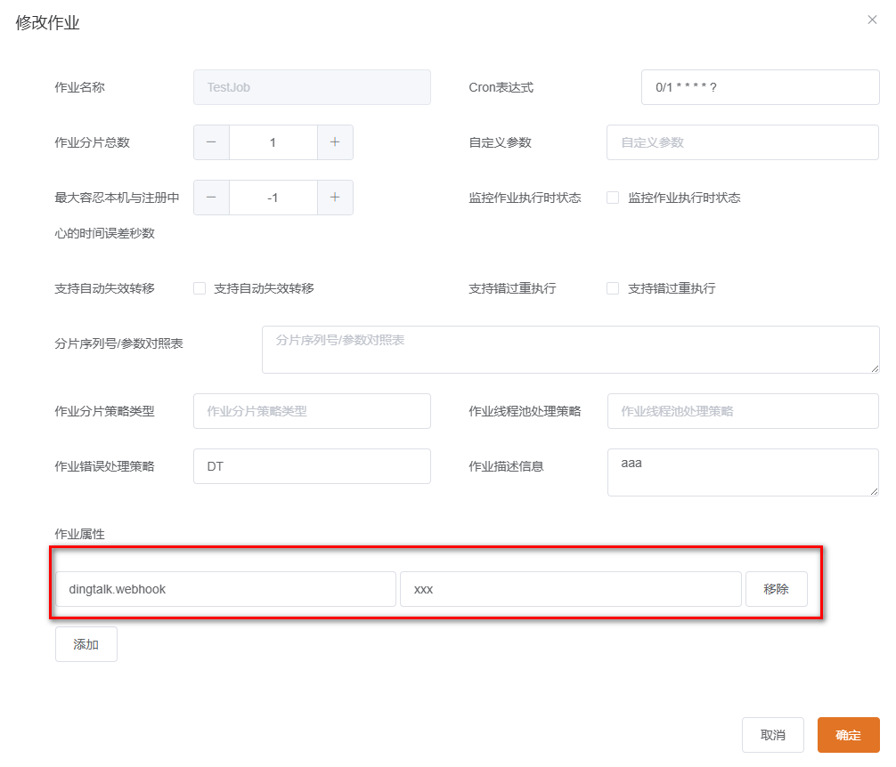

# JLK-Job


## 概述
基于elastic-job，提供spring注解方式创建任务

### 1. 快速开始

#### 引入maven

```xml
<dependency>
    <groupId>cn.liujinnan.java.library.kit</groupId>
    <artifactId>jlk-job</artifactId>
    <version>${version}</version>
</dependency>
```
#### 创建任务
```java
/**
 * @see cn.liujinnan.jlk.job.annotation.JobAnnotation
 */
@Component
@JobAnnotation(cron = "0/10 * * * * ?", shardingTotalCount = 1, description = "bbb", shardingTotalCount = 3, shardingItemParameters = "0=a,1=b,3=c")
public class Test2 implements AbstractSimpleJob {
    @Override
    public void executeJob(ShardingContext shardingContext) {
        switch (shardingContext.getShardingItem()) {
            case 0:
                // do something by sharding item 0
                //StringUtils.equals(shardingContext.getShardingParameter(), "a") == true
                break;
            case 1:
                // do something by sharding item 1
                //StringUtils.equals(shardingContext.getShardingParameter(), "b") == true
                break;
            case 2:
                // do something by sharding item 2
                //StringUtils.equals(shardingContext.getShardingParameter(), "b") == true
                break;
            // case n: ...
        }
    }
}

```
#### 配置
```properties
# 必要配置 Necessary Configuration
# zookeeper 多个逗号分隔
elasticjob.reg-center.server-lists=ip1:port1,ip2:port2
elasticjob.reg-center.namespace=namespace
```

### 2. 自定义错误处理

#### 钉钉预警
jobErrorHandlerType="DT"，发送钉钉预警。多种方式配置

* 第一种
```java
// Configure the jobErrorHandlerType attribute in the annotation
// 在注解中配置jobErrorHandlerType
@Component
@JobAnnotation(cron = "0/10 * * * * ?", jobErrorHandlerType = "DT")
public class Test2 implements AbstractSimpleJob {
    @Override
    public void executeJob(ShardingContext shardingContext) {
        // running
    }
}
```
```properties
# 全局钉钉url配置
elasticjob.jobs.props.dingtalk.webhook=https://oapi.dingtalk.com/robot/send?access_token=xxx
```

* 第二种
```java
// Configure the jobErrorHandlerType attribute in the annotation
// 在注解中配置jobErrorHandlerType
@Component
@JobAnnotation(cron = "0/10 * * * * ?", jobErrorHandlerType = "DT", props = {
        @JobProp(key = "dingtalk.webhook", value = "https://oapi.dingtalk.com/robot/send?access_token=xxx")
})
public class Test2 implements AbstractSimpleJob {
    @Override
    public void executeJob(ShardingContext shardingContext) {
        // running
    }
}
```

作业属性配置

